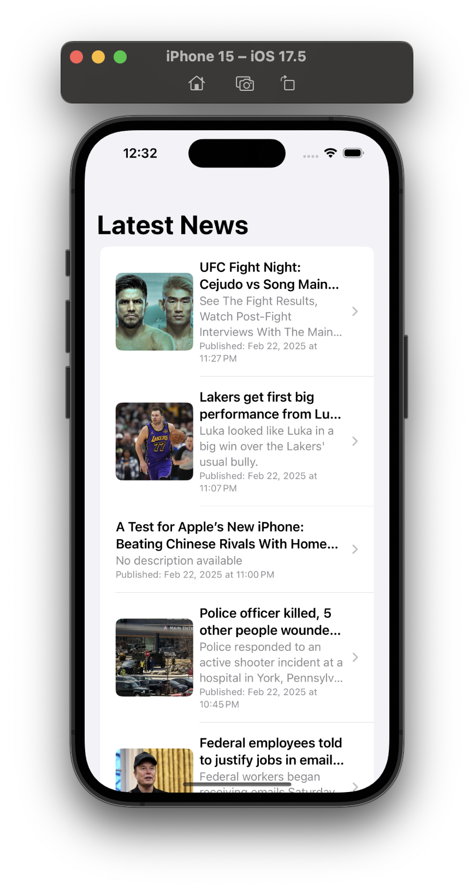
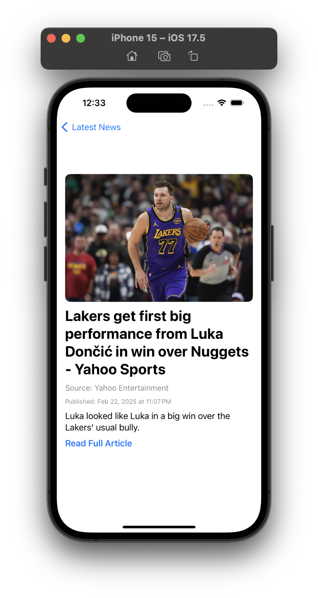

# NewsApp_SwiftUI

A SwiftUI-based iOS news application that displays the latest news articles. Users can view a list of news articles and click on each article to see the details. The app also provides a "Read More" button to open the full article in a browser.

- The project follows the MVVM (Model-View-ViewModel) architecture to maintain a clean separation of concerns and enhance scalability.
- For networking, I used URLSession with Combine to ensure efficient asynchronous data fetching and error handling. AsyncImage was implemented for image loading, providing a seamless user experience.

## Features
- Fetch and display top news headline from [NewsAPI](https://newsapi.org/)
- View article details including title, description, and source.
- Open full articles in a browser.
- Error handling for network failures.
- Uses `AsyncImage` for image loading.

## Requirements
- Xcode 13+
- iOS 15+
- Swift 5+
- Network

## Installation & Setup
1. Clone the repository:
   ```sh
   https://github.com/ayugohel/NewsApp_SwiftUI
   ```
2. Open `NewsApp.xcodeproj` in Xcode.
3. Build and run the project using Xcode.

## Usage
- Launch the app.
- News articles are fetched automatically.
- Tap an article to view details.
- Click the "Read Full Article" link to open it in the browser.

### Screenshots
 
